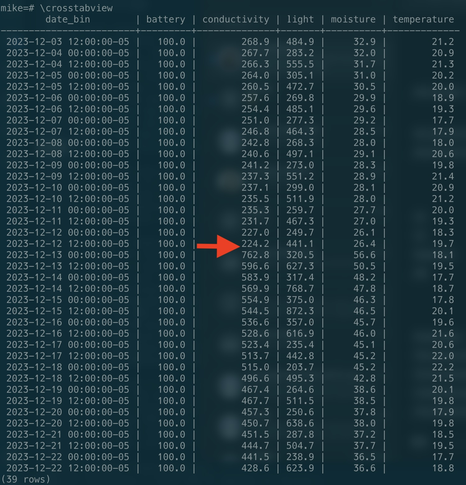

# Miflora postgres logger

This is a simple script to log miflora sensor data to a postgres database. I run it in cron on a raspberry pi. 

It is intended to be used with [Miflora plant sensors](https://www.aliexpress.com/w/wholesale-miflora.html), which use Bluetooh Low Energy to send information about 
moisture, conductivity and light readings.

# Setup

## Create the required Postgres tables

See `tables.sql`

## Find the sensor bluetooth addresses 

Use `bluetoothctl` on Linux to find the bluetooth addresses of the sensors. It's provided by the `bluez` package.

For example:

```
$ sudo bluetoothctl scan on
... <lots of output in my apartment building>

[CHG] Device D1:32:32:33:2B:86 RSSI: -87
[CHG] Device 4C:E1:73:E6:E0:25 RSSI: -77
[CHG] Device 4C:E1:73:E6:E0:31 RSSI: -74
[NEW] Device D8:9D:CB:60:30:29 D8-9D-CB-60-30-29
[CHG] Device D4:AD:FC:F7:67:45 RSSI: -72
[NEW] Device 5C:85:AB:CD:DE:FF Flower care
[CHG] Device 68:86:7E:37:F0:CC RSSI: -36
[CHG] Device 5A:9F:39:E1:17:6D RSSI: -80
[CHG] Device 79:89:CE:86:48:7E RSSI: -51
[CHG] Device 4C:E1:73:E6:E0:DF RSSI: -87
...

```

You're looking for `Flower care`. In this example, `5C:85:AB:CD:DE:FF` is the btle mac of my sensor. 

Once you have them, insert the addreses into the assignment table, by running:

```
INSERT INTO miflora_sensor_assignments (name, mac) values ('monstera' 'ab:cd:12:34:56:78');
```

## Schedule reader.py

I put an entry in my crontab to poll the data regularly (using pyenv here, but any python3 will do):

```
*/10 * * * * $HOME/.pyenv/shims/python3 $HOME/src/miflora/reader.py

```

# Querying the data

```
SELECT date_bin(interval '4 hours', reading_date, '2023-12-12'), metric, round(avg(metric_value)::numeric,1) FROM miflora_readings JOIN miflora_sensor_assignments msa on sensor_id = msa.id 
WHERE name='lemon' and reading_date >= now() - interval '7 days' 
GROUP BY 1,2 
ORDER BY 1,2;

```

I also like to use `\crosstabview` in `psql` to show the data in a table. 

